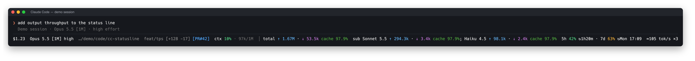
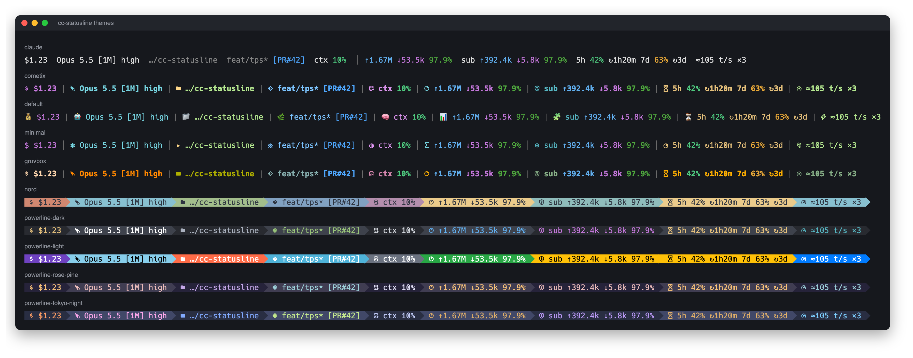
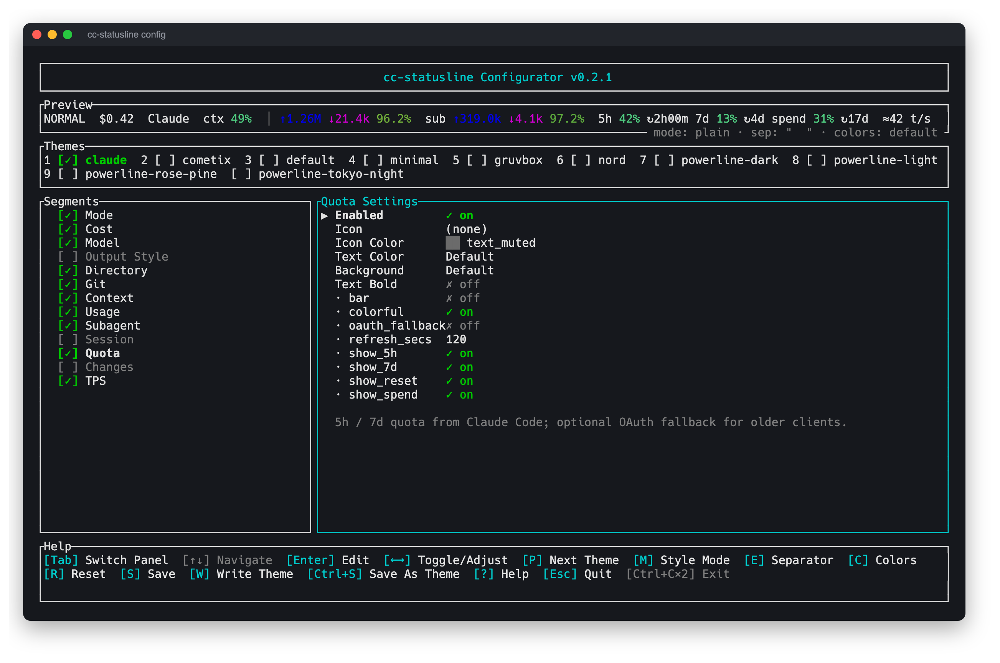
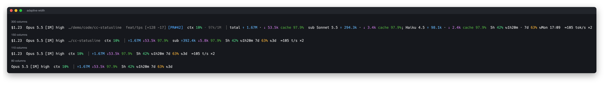
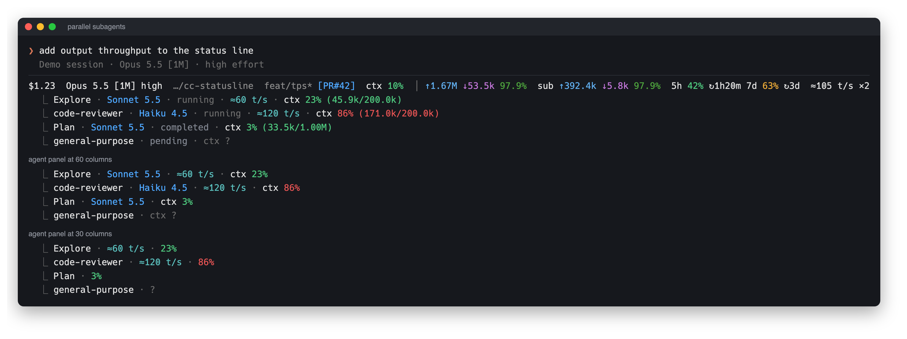

<div align="center">

# cc-statusline

**在 Claude Code 底栏直接看到这次会话花了多少：token、缓存命中率、套餐额度。**

[](https://github.com/Demogorgon314/cc-statusline/releases)
[](https://github.com/Demogorgon314/cc-statusline/actions)
[](LICENSE)


[English](README.md) | 中文



</div>

## 安装

```bash
curl -fsSL https://raw.githubusercontent.com/Demogorgon314/cc-statusline/main/install.sh | sh
```

重启 Claude Code 即可加载状态栏。

<details>
<summary>Windows、手动配置或源码安装</summary>

**Windows（PowerShell）**

```powershell
irm https://raw.githubusercontent.com/Demogorgon314/cc-statusline/main/install.ps1 | iex
```

**从源码安装**

```bash
cargo install --git https://github.com/Demogorgon314/cc-statusline --locked
cc-statusline install
```

已有本地仓库时，运行 `cargo install --path . --locked`，再运行 `cc-statusline install`。

**手动配置** `~/.claude/settings.json`：

```json
{
  "statusLine": {
    "type": "command",
    "command": "cc-statusline",
    "padding": 0
  }
}
```

将这个对象合并到已有配置。自动安装器会使用带引号的可执行文件绝对路径，不依赖 PATH；保留无关设置，备份为 `settings.json.bak`，且不会覆盖别人的状态栏命令（需要的话加 `install --force`）。`CLAUDE_CONFIG_DIR` 可以覆盖默认的 `~/.claude` 路径。

需要支持命令式状态栏的 Claude Code。Windows 下 Claude 通过 Git Bash 执行命令。Nerd Font 和 powerline 样式需要终端使用 Nerd Font；默认 plain 样式不需要。

</details>

## 为什么用它

不用打断工作，就能随时看到 Claude Code 会话的这些信息：

- 📊 **整个会话一共用了多少 token**（主 agent 加可见的子 agent），以及**缓存命中率**，低红高绿
- ⏳ **5 小时和 7 天额度用了多少**、什么时候重置（例如 `5h 42% ↻1h20m`）
- 🧩 **哪个子 agent 模型输入用量最多**，以及 Claude 估算的会话费用
- 🌿 **git 状态一眼可见**：改动行数、ahead/behind、可点击的 `[PR#42]`

模型和实时思考强度、上下文占用、Vim / agent / fast 模式徽标、估算输出速度也都能显示。模型名称中的长上下文说明会简写成 `Opus 5.5 [1M]`。

## 随心定制



10 套内置主题，从 Claude 配色的默认样式，到完整的 powerline。运行 `cc-statusline` 后选择配置器，或用 `cc-statusline config` 直接打开：



开关和排序各个段、选颜色和图标、切换主题，用你自己会话的数据实时预览。键盘和鼠标都能操作：单击选中，再点一次切换或编辑，拖动段来调整顺序，滚轮上下移动。设计参考 [CCometixLine](https://github.com/Haleclipse/CCometixLine)。

在任意 TUI 界面，**1.5 秒内连按两次 Ctrl+C** 即可退出。第一次会显示确认提示，退出时丢弃未保存的修改。

## 为速度而生

cc-statusline 是单个 Rust 二进制。会话变长时，每次刷新仍限制处理量：

- **增量读取**会话日志：从缓存游标继续，每个文件最多读取 4 MiB，每次刷新解析预算为 100 ms；历史记录分多次刷新追上
- 可选的 OAuth 额度刷新、`gh pr view` 都在**后台**做；Claude 原生额度无需额外请求
- 终端变窄时**自动精简**，压缩显示并逐步去掉优先级较低的段



并行运行子任务时，底栏显示合计输出速度和正在输出的日志数（`≈39 t/s ×2`）；可选的子任务面板为每个子任务单独显示速度和上下文占比，变窄时整个面板统一去掉字段。



## 参考

<details>
<summary>所有段</summary>

| id | 内容 |
| --- | --- |
| `mode` | Vim 模式、agent 名称、fast 模式徽标 |
| `cost` | Claude 估算的会话费用（美元） |
| `model` | 模型和实时思考强度；简写的 `[1M]` 后缀 |
| `output_style` | 输出风格（默认关闭） |
| `directory` | 工作目录 |
| `git` | 分支、改动统计、冲突、ahead/behind、打开的 PR（回退查询需要 `gh`） |
| `context` | 主会话上下文占用百分比和输入 token / 容量（`ctx 62% · 620k/1M`）；`bar = true` 显示进度条 |
| `usage` | 整个会话的输入 ↑ / 输出 ↓ / 缓存命中率，包含子 agent |
| `subagent` | 子任务累计用量：输入最多的两个模型，其余显示 `+N 个模型`；紧凑模式显示子任务合计 |
| `session` | 累计会话时长（默认关闭） |
| `quota` | 5h / 7d 额度、可选的网关消费上限和重置时间 |
| `changes` | 会话新增 / 删除行数（默认关闭） |
| `tps` | 近期每秒生成的输出：`≈42 tok/s`；最近 30 秒有三个日志在输出时附加 `×3`（紧凑模式为 `≈42 t/s ×3`） |

空间不够时按这个顺序去掉：session → changes → git → directory → subagent → tps → output_style → cost → context → quota → mode。

`ctx` 统计主会话的输入、缓存读取和写入，不含输出；优先使用 Claude 原生百分比。各子任务拥有独立上下文，不累加到这个百分比。`sub` 段按模型汇总累计用量，包含已完成任务；紧凑模式只显示输入最多的一个模型和其余模型数量。会话累计用量只读取明确传入的 transcript 及其相邻子 agent 日志，按消息 ID 去重；不完整的用量以 `≈` 标记并变暗。缺失会话不会继承其他会话的统计。额度属于账号，可以跨会话保留。

预览和配置器使用当前目录最近收到的状态栏数据。`preview --session ID` 只接受匹配的缓存会话。还没有数据时，预览显示通用 Claude 标签，配置器会为缺失字段补上演示值。

**TPS 怎么计算**

```text
最近 30 秒观察到的去重输出 token 增量 / 窗口实际经过的秒数
```

主会话与可见的并行子任务合并统计，三个子任务同时输出时约为单个任务的三倍。它替代旧版按 API 时间折算的估算：transcript 和 API 计时分别更新，无法可靠配对，因此 API 计时字段不再影响 TPS。这是输出吞吐，不是模型解码速度；请求区间包含首 token 等待时间。

Claude 在每个内容块结束后才写入日志。因此不在刷新时“看到”输出才计数，而是把每个去重后的请求均匀分摊到它自己的 transcript 区间（从前一条 user / tool_result 记录到最后一个内容块），速度取最近 30 秒“有请求在生成”的时间。执行工具或等待你输入的时间不算生成，不会把速度拉向零。速度只由日志时间戳决定：晚发现的子任务日志、稍后才追平的积压、并发刷新和恢复会话都会得到相同结果。fork 出的子任务里复制的父消息沿用原始请求时间。历史不足 30 秒时用已有的生成时长作分母，至少一秒。半行日志或暂时不可读时数值变暗，其他日志继续采集。预览只读已保存的快照，不推进游标。扫描在时间预算内轮转，未变化的日志只需一次 `stat`；非阻塞会话锁让并发刷新直接复用上次快照。

新配置默认开启 TPS；已有配置请在 `cc-statusline config` 中开启 **TPS**。停止输出后保留最后的速度，不会衰减到零；默认五分钟没有新输出后变暗（`stale_secs`，或用 `hide_when_stale` 隐藏）。`install` 会在缺失时添加 `statusLine.refreshInterval: 1`，让主任务等待期间也能刷新后台子任务输出和变暗状态；保留用户明确设置的刷新间隔。这会每秒运行一次命令；共享的 300 ms 截止时间和 git / 会话缓存让每次运行保持轻量，调大间隔可用新鲜度换取更少的运行次数。已有安装可重新执行 `cc-statusline install`，或手动补上该字段。升级时忽略旧版 TPS 缓存。

**逐 agent 上下文**

执行 `cc-statusline install --subagents` 安装独立的子任务面板渲染器。保留主状态栏；遇到其他渲染器时，只有显式传入 `--force` 才会替换。`cc-statusline uninstall --subagents` 仅移除此 hook。构建程序或单独运行渲染器不会修改设置。

该 hook 调用 `cc-statusline subagents`，接收 Claude 的 `tasks` 数组，逐行输出 JSON，展示各任务名称、模型、状态、各自的近期输出速度（来自 `agent-<id>.jsonl`，仅运行中任务）和独立上下文占比。缺少上下文字段时显示 `上下文 ?`，不会误报为零。行宽遵循输入的 `columns`（可用 `--width` 覆盖），整个面板统一按顺序去掉字段：token 明细、状态、标签、模型、速度；上下文占比始终保留，最后才缩短名称。上下文字段需要 Claude Code v2.1.205 或更新版本，详见[官方协议](https://code.claude.com/docs/en/statusline#subagent-status-lines)。

</details>

<details>
<summary>配置文件</summary>

`~/.claude/cc-statusline/config.toml`（自定义主题放在 `themes/<name>.toml`），沿用 CCometixLine 按段配置的形式：

```toml
theme = "claude"

[style]
mode = "plain"          # plain | nerd_font | powerline
separator = "  "        # "" 为 powerline 箭头
palette = "dark"        # dark | light | 自定义配色名
width = 0              # 自动检测；--width 优先

[[segments]]
id = "quota"
enabled = true
colors = { text = "text_dim" }
options = { show_5h = true, show_7d = true, show_spend = true, show_reset = true, bar = false, oauth_fallback = false, refresh_secs = 120 }

[[segments]]
id = "tps"
enabled = true
options = { stale_secs = 300, hide_when_stale = false }
```

段按配置顺序显示，未列出的段会追加但保持关闭。用 `cc-statusline init` 生成完整的初始配置。TPS 设置 `hide_when_stale = true` 可隐藏过时或不完整的估算；`stale_secs = 0` 可关闭按时间变暗，但不完整数据仍会变暗。

颜色支持配色名（`primary`、`accent`、`text_dim`、`success`、`warning`、`error` 等）、`"#rrggbb"`、`{ c16 = 14 }`、`{ c256 = 208 }` 或 `{ r = 1, g = 2, b = 3 }`。自定义配色放在 `palettes/<name>.json`，包含 `base`（`dark` / `light`）和 `colors` 对象，颜色键使用 `textDim` 等 camelCase 名称。

内置主题：`claude`、`cometix`、`default`、`minimal`、`gruvbox`、`nord`、`powerline-dark`、`powerline-light`、`powerline-rose-pine`、`powerline-tokyo-night`。

可选的 `~/.claude/cc-statusline/models.toml` 按收到的完整模型显示名或 ID 设置别名：

```toml
"claude-sonnet-custom" = "Team Sonnet"
```

</details>

<details>
<summary>额度是怎么拿到的</summary>

优先使用 Claude 原生的 `rate_limits`，不需要额外请求或读取登录凭据。旧版客户端可以开启 `oauth_fallback = true`；后台刷新最多每 `refresh_secs` 秒一次（最短 30 秒）。`cc-statusline quota` 会主动请求 OAuth 用量接口。

回退模式读取 Claude 已有的 macOS Keychain 或 `.credentials.json` 登录凭据，请求 `https://api.anthropic.com/api/oauth/usage`。不会刷新或写入登录 token。请求失败时保留最后的缓存值；API key 和第三方账号可以保持关闭回退。

Claude 没有提供 PR 时，也会在后台查询 PR。将 git 段的 `pr = false` 即可关闭查询。缓存位于 `~/.claude/cc-statusline-cache/`。

</details>

<details>
<summary>命令、调试、卸载</summary>

```bash
cc-statusline                     # 菜单：配置、安装、测试额度、检查更新……
cc-statusline config              # 配置器
cc-statusline init                # 写入默认配置；--force 可覆盖
cc-statusline themes              # 列出主题
cc-statusline -t nord preview     # 在终端里预览某个主题
cc-statusline preview --cwd /path/to/project --width 100
cc-statusline quota               # 立即拉取额度
cc-statusline update              # 最新发布版本；--check 只检查
cc-statusline uninstall           # 移除自己的 statusLine 设置，然后重启 Claude
```

- 调试日志：`touch ~/.claude/cc-statusline-debug`，然后看 `~/.claude/cc-statusline-debug.log`。也可以设置 `CC_STATUSLINE_DEBUG=1`。
- 设置 `NO_COLOR=1` 或 `CC_STATUSLINE_NO_COLOR=1` 关闭颜色。
- 试用示例数据：`cargo run -- --theme claude --width 160 < examples/claude.json`。
- 更新会校验 SHA256。卸载保留无关配置和其他应用的状态栏。

</details>

## 参与开发

```bash
cargo fmt --check
cargo clippy --locked --all-targets -- -D warnings
cargo test --locked
cargo build --release --locked
uv run --with pyte python scripts/screenshots.py
```

截图脚本需要 Chrome、ImageMagick 和 Nerd Font，通过 PTY 在 macOS / Linux 上运行。`SHOT_CHROME` 可指定 Chrome 路径，`SHOT_FONT` 可指定字体。已安装 `pyte` 时也可直接运行 `python3 scripts/screenshots.py`。图片使用合成演示数据，由实际二进制和配置器渲染，再放入 HTML 终端框架。

发布新版本：同步更新 `Cargo.toml` 和 `Cargo.lock`，推送对应的 `vX.Y.Z` tag。CI 检查 Linux、macOS 和 Windows；发布工作流构建六种平台归档和校验文件。

致谢：[kimi-statusline](https://github.com/Demogorgon314/kimi-statusline)（项目基础、README 和截图设计）、[CCometixLine](https://github.com/Haleclipse/CCometixLine)（配置器和主题设计）。协议参考：[Claude Code 状态栏文档](https://code.claude.com/docs/en/statusline)。

## License

MIT
